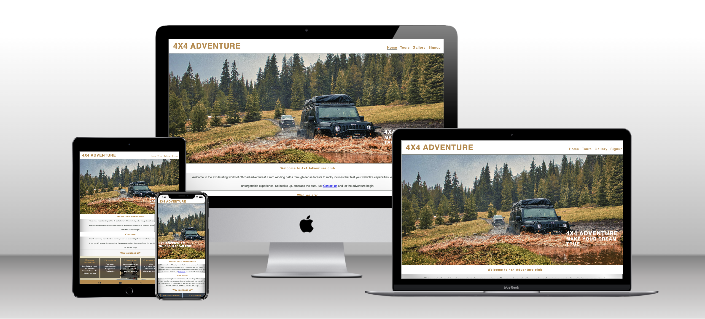

<h1 align="center">4X4Adventure Website</h1>

[View the live project here.](https://naviid24.github.io/project-1/)

It is designed to be responsibe and accessible on a range of devices, making it easy to navigate for people.

<a href="https://naviid24.github.io/project-1/" target="_blank" ></a>

## User Experience (UX)

-   ### User stories

    -   #### First Time Visitor Goals

        1. As a First Time Visitor, I want to easily understand the main purpose of the site and learn more about the organisation.
        2. As a First Time Visitor, I want to be able to easily navigate throughout the site to find content.
        3. As a First Time Visitor, I want to look for testimonials to understand what their users think of them and see if they are trusted. I also want to locate their social media links to see their followings on social media to determine how trusted and known they are.
        4. As a First Time Visitor, I want to see where are they based and what is their address and their phone number.
        5. As a First Time Visitor, I want to see what reviews rate they have on the TrustPilot website and what the people said about them.
        6. As a First Time Visitor, I want to see a summery of this company.
        7. As a First Time Visitor, I want to see how much they are talent to make an attractive website for their clients or users.
        8. As a First Time Visitor, I want to have access to a gallery to see where they have been so far and what places they have visited.
        9. As a First Time Visitor, I want to use this website easily on my phone.
        10. As a First Time Visitor, I want to know that I can bring my car or should I have to join without a car.
        11. As a First Time Visitor, I want to know about their insurance policy.
        12. As a First Time Visitor, I want to know if this trip is going to be out of the UK and how they provide safety to us.
        13. As a First Time Visitor, I want to know what options are available for payment.
        14. As a First Time Visitor, I want to see photos of the drivers and tour leaders.

    -   #### Returning Visitor Goals
       
        1. As a Returning Visitor, I want to find information about upcoming Tours.
        2. As a Returning Visitor, I want to find the best way to get in contact with the organisation with any questions I may have.
        3. As a Returning Visitor, I want to find community links.
        4. As a Returning Visitor, I want to see where they have been recently or where they are now so would be better to see their live-streaming tours.
        5. As a Returning Visitor, I want to find out is here any new offers for the coming season.
        6. As a Returning Visitor, I want to know when is next local off-road race.

    -   #### Frequent User Goals
       
        1. As a Frequent User, I want to check to see if there are any newly added challenges for their monthly challenge. Such as driving through a river with 1 meter depth.
        2. As a Frequent User, I want to check to see if there are any new blog posts about introducing new or high-rated off-road cars for the year.
        3. As a Frequent User, I want to sign up for the Newsletter so that I am emailed any major updates and/or changes to the website or organisation.
        4. As a Frequent User, I want to read new articles about off-road news around the world.
        5. As a Frequent User, I want to buy off-road accessories for my own trips.
        6. As a Frequent User, I want to see their new gallery photo/s.
        7. As a Frequent User, I want to participate in their monthly lottery.
     
    -   #### Website Owner Goals
     
       1. As a website owner, I want to make a friendly and exciting sports community.
       2. As a website owner, I want to make my community busy.
       3. As a website owner, I want to have a really well-managed social media.
       4. As a website owner, I want to make my website's views very high.
       5. As a website owner, I want to prepare a good base for my business to make money from selling our products.
       6. As a website owner, I want to have different options for making payments, especially PayPal.
       7. As a website owner, I want to get involved with more people on my website.
       8. As a website owner, I want to make sure their first visit is very interactive and get them stuck in the website
       9. As a website owner, I want to make a trustworthy and busy platform for people to sell their new or used off-road products here.

-   ### Design
    -   #### Colour Scheme
        -   The two main colours used are : font color #B84 and background color #FDA.
    -   #### Typography
        -   The Roboto font is the main font used throughout the whole website with Sans Serif as the fallback font in case for any reason the font isn't being imported into the site correctly.
    -   #### Imagery
        -  The large, background hero image is designed to be striking and catch the user's attention. It also has a modern, energetic aesthetic.

*   ### Wireframes

    - Wireframe for mobile screens - [View](assets/wireframes/wireframe-mobile.png).

    - Wireframe for tablet screens - [View](assets/wireframes/wireframe-tablet.png).

    - Wireframe for monitor screens - [View](assets/wireframes/wireframe-monitor.png).

## Features

-   Responsive on all device sizes.[view](assets/readme-photos/responsive.png)
-   Dropdown nev bar for small screen devices.[view](assets/features-photos/dropdown-navbar.png)
-   Contact form.[view](https://naviid24.github.io/project-1/signup.html)
-   Social media links and icons.[view](assets/features-photos/social-media-icons.png)
-   Access to user reviews.
-   Gallery.[view](https://naviid24.github.io/project-1/gallery.html)
-   Payment options.
-   Monthly lottery draw.
-   Buying products.
-   People can buy and sell the off-road products.
  

## Technologies Used

### Languages Used

-   [HTML5](https://en.wikipedia.org/wiki/HTML5)
-   [CSS3](https://en.wikipedia.org/wiki/Cascading_Style_Sheets)

### Frameworks, Libraries & Programs Used

1. [Hover.css:](https://ianlunn.github.io/Hover/)
    - Hover.css was used on the nav-bar in the header to add the underline while user is navigating to see which page he is on.
1. [Google Fonts:](https://fonts.google.com/)
    - Google fonts were used to import the 'Roboto' font into the style.css file which is used on all pages throughout the project.
1. [Font Awesome:](https://fontawesome.com/)
    - Font Awesome was used on all pages throughout the website to add icons for aesthetic and UX purposes.
1. [Gitpod](https://gitpod.io/)
    - Gitpod was used for version control by utilizing the Gitpod terminal to commit to Git and Push to GitHub.
1. [GitHub:](https://github.com/)
    - GitHub is used to store the project's code after being pushed from Gitpod.
1. [Photoshop:](https://www.adobe.com/ie/products/photoshop.html)
    - Photoshop was used to create the logo, resize images and edit photos for the website.
1. [Balsamiq:](https://balsamiq.com/)
    - Balsamiq was used to create the [wireframes](https://github.com/) during the design process.

## Testing

The W3C Markup Validator and W3C CSS Validator Services were used to validate every page of the project to ensure there were no syntax errors in the project.
-   [W3C Markup Validator]()
-   [W3C CSS Validator](https://jigsaw.w3.org/css-validator/#validate_by_input)

#### First testing resault with error in css files and info in html files

+ For all html files I had same issue, IT wasen't error or warning it was just for info and I fixed them.As you can see in my screen-shot I had closing element sign in my codes (Trailing slash) at the end of the element and also space before them, so I got back to my code and fixed it.
  -  [HTML files error](assets/code-validate/validate-code-checking.png).
+ In the css file I had a property value error that you can see in the photo below.
  -  [CSS file error](assets/code-validate/css-validation-error.png).

#### Second Testing after sort out issues

 As you can see in the photos below there are no any error in my codes in the all css and html pages.
1. [view css file validation code](assets/code-validate/css-code-validation.png)
2. [view Home page validation code](assets/code-validation-screenshots/index-code-validation.png) 
3. [view Tour page validation code](assets/code-validate/tours-code-validation.png)
4. [view Gallery page validation code](assets/code-validate/gallery-code-validation.png)
5. [view Signup page validation code](assets/code-validate/signup-code-validation.png)
   

### Testing User Stories from User Experience (UX) Section

-   #### First Time Visitor Goals

    + As a First Time Visitor, I want to easily understand the main purpose of the site and learn more about the club.

        - Upon entering the site, users are automatically greeted with a clean and easily readable navigation bar to go to the page of their choice. 
        - The hero image has a clear and readable cover text to show what the website is about.
        - The user can scroll down, to learn more about the club.

    + As a First Time Visitor, I want to be able to easily be able to navigate throughout the site to find content.

        - The site has been designed to four pages and clearly in each page the user can find needed informatiion and see all content easily.
        - At the bottom of the first 3 pages there are social media icons with links to ensure the user always has somewhere to go and see more about the club and doesn't feel trapped.
        - On the Signup Page, after a form response is submitted, the page will show the user their form has been submited successfully.

    + As a First Time Visitor, I want to look for testimonials to understand what their users think of them and see if they are trusted. I also want to locate their social media links to see their following on social media to determine how trusted and known they are.
        - Once the new visitor has read the About Us, they will notice the Why We are Loved So Much section.
        - The user can also scroll to the bottom of any page on the site to locate social media links in the footer.

    + As a First Time Visitor, I want to see where are they based and what is their address and their phone number.
        - User can see contact information in the first page of the site with a background color to ensure they are very clear to see and readable.
        - User can find us on our social media links and see our address there too.
    + As a First Time Visitor, I want to have access to a gallery to see where they have been so far and what places they have visited.
        - Use can navigate to the Gallery page to see many photos from different locations and tours the club has done before.
        - User can have more clear idea about trips and tours after navigating in Gallery page.

```
//comment: for the rest of First Time Visitor Goals I didn't do them in the website but I wrote them here to get back them on future because I haven't learned them yet.
```
-   #### Returning Visitor Goals

    1. As a Returning Visitor, I want to find information about upcoming Tours.

        1. These are clearly shown in the Tours page.

    2. As a Returning Visitor, I want to find the best way to get in contact with the organisation with any questions I may have.
       1. in the middle of the Home page the user can find and see contact details.
       2. The user can click on social media icons on the footer of the all pages.
       3. The user can be contacted with club through the Signup page
       
    3.As a Returning Visitor, I want to see where they have been recently or where they are now so would be better to see their live-streaming tours.
       1. The user can navigate in the Gallery page and see tTours page to find out about upcoming tours and previous 
          tours.
    4. Whichever link they click, it will be open up in a new tab to ensure the user can easily get back to the website.
        5. The email button is set up to automatically open up your email app and autofill there email address in the "To" section.

    4. As a Returning Visitor, I want to find the Facebook Group link so that I can join and interact with others in the community.
        1. The Facebook Page can be found at the footer of every page and will open a new tab for the user and more information can be found on the Facebook page.
        2. Alternatively, the user can scroll to the bottom of the Home page to find the Facebook Group redirect card and can easily join by clicking the "Join Now!" button which like any external link, will open in a new tab to ensure they can get back to the website easily.
        3. If the user is on the "Our Favourites" page they will also be greeted with a call to action button to invite the user to the Facebook group. The user is incentivized as they are told there is a weekly favourite product posted in the group.

```     
//comment: for the rest of returning visitor goals I didn't do them in the website but I wrote them here to get back them on future because I haven't learned them yet.
```
-   #### Frequent User Goals

    1. As a Frequent User, I want to check to see if there are any newly added challenges .

        1. The user would be mailed for new chalanges through email after they signed up through the Signup page.

    2. As a Frequent User, I want to check to see if there are any new blog posts.

        1. The user would already be comfortable with the website layout and can easily click the weekly blog link.

    3. As a Frequent User, I want to sign up to the Newsletter so that I am emailed any major updates and/or changes to the website or club.
        1. At the bottom of every page there is a footer which contain social media links throughout all pages.
```    
//comment: for the rest of Frequent User Goals I didn't do them in the website but I wrote them here to get back to them on future hopefully to fix them or if anyone was interested to fix them or continue them.
```

### Further Testing

-   The Website was tested on Google Chrome, Internet Explorer, Microsoft Edge and Safari browsers.
-   The website was viewed on a variety of devices such as Desktop, Laptop, iPhone7, iPhone 8 & iPhoneX.
-   A large amount of testing was done to ensure that all pages were linking correctly.
-   Friends and family members were asked to review the site and documentation to point out any bugs and/or user experience issues.

### Known Bugs

- I coulden't find any bug.

## Deployment

### GitHub Pages

The project was deployed to GitHub Pages using the following steps...

1. Log in to GitHub and locate the [GitHub Repository](https://github.com/)
2. At the top of the Repository (not top of page), locate the "Settings" Button on the menu.
    - Alternatively Click [Here](https://raw.githubusercontent.com/) for a GIF demonstrating the process starting from Step 2.
3. Scroll down the Settings page until you locate the "GitHub Pages" Section.
4. Under "Source", click the dropdown called "None" and select "Master Branch".
5. The page will automatically refresh.
6. Scroll back down through the page to locate the now published site [link](https://github.com) in the "GitHub Pages" section.

### Forking the GitHub Repository

By forking the GitHub Repository we make a copy of the original repository on our GitHub account to view and/or make changes without affecting the original repository by using the following steps...

1. Log in to GitHub and locate the [GitHub Repository](https://github.com/)
2. At the top of the Repository (not top of page) just above the "Settings" Button on the menu, locate the "Fork" Button.
3. You should now have a copy of the original repository in your GitHub account.

### Making a Local Clone

1. Log in to GitHub and locate the [GitHub Repository](https://github.com/)
2. Under the repository name, click "Clone or download".
3. To clone the repository using HTTPS, under "Clone with HTTPS", copy the link.
4. Open Git Bash
5. Change the current working directory to the location where you want the cloned directory to be made.
6. Type `git clone`, and then paste the URL you copied in Step 3.

```
$ git clone https://github.com/YOUR-USERNAME/YOUR-REPOSITORY
```

7. Press Enter. Your local clone will be created.

```
$ git clone https://github.com/YOUR-USERNAME/YOUR-REPOSITORY
> Cloning into `CI-Clone`...
> remote: Counting objects: 10, done.
> remote: Compressing objects: 100% (8/8), done.
> remove: Total 10 (delta 1), reused 10 (delta 1)
> Unpacking objects: 100% (10/10), done.
```

## Credits

### Code

-   The full-screen hero image code came from this [loverunning](https://learn.codeinstitute.net/)

### Content

-   All content was written by the developer and.

### Media

-   All Images were downloaded from [Pixeles website](https://www.pexels.com/)

### Acknowledgements

-   During this project, my Mentor John, advised me on many methods in this field and I learned many new things about website developing and testing and ReadMe file writing and many other things.Thanks John for all your advise.

-   Tutor support at Code Institute helped me to set up my GitPod account.
